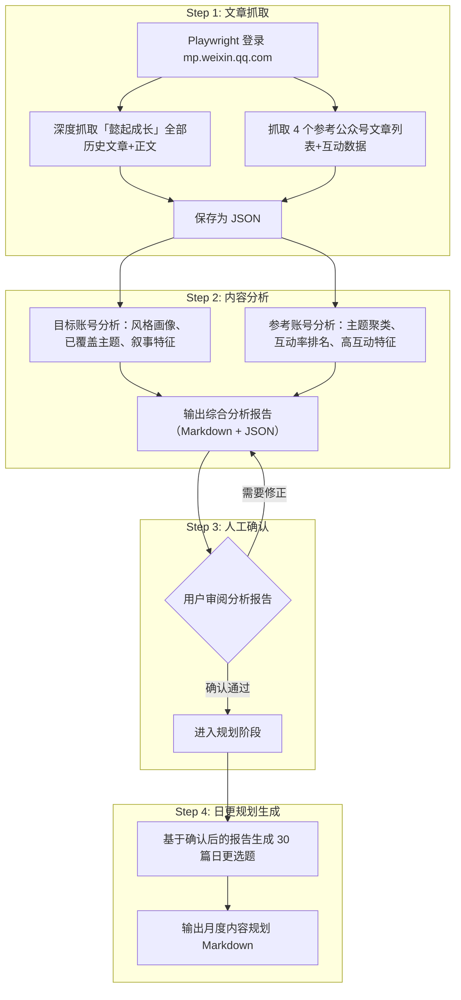

# 公众号内容规划工具

## 现状分析

- `creator/` 目录当前为空，需要从零搭建
- 项目已有成熟的 Playwright 浏览器自动化基础设施（`[media-publisher/src/media_publisher/core/browser.py](media-publisher/src/media_publisher/core/browser.py)` 的 `PlaywrightBrowser` 类），可复用认证状态管理模式
- 已有 mp.weixin.qq.com 的登录流程（`[media-publisher/src/media_publisher/core/gzh.py](media-publisher/src/media_publisher/core/gzh.py)` 的 `authenticate_gzh` 函数）
- 已有降低 AI 检测率的写作指南（`[media-publisher/docs/降低AI检测率优化指南.md](media-publisher/docs/降低AI检测率优化指南.md)`）
- "懿起成长"已有 5 篇文章，风格为：**土木工程师爸爸、第一人称叙事、技术分享 + 生活感悟、口语化但不刻意、承认不完美**

## 架构设计




## 目录结构

```
creator/
├── pyproject.toml              # uv 项目配置
├── README.md                   # 使用说明
├── src/
│   └── creator/
│       ├── __init__.py
│       ├── __main__.py         # CLI: python -m creator scrape / plan
│       ├── scraper.py          # mp.weixin.qq.com 文章抓取
│       ├── analyzer.py         # 文章数据分析
│       └── planner.py          # 内容规划生成
├── config/
│   └── target.json             # 目标/参考公众号配置
└── output/                     # 生成的规划文档和数据
    ├── articles/               # 抓取的文章数据 JSON
    └── plans/                  # 生成的规划 Markdown
```

## 核心实现细节

### 1. 文章抓取器 (`scraper.py`)

复用 `PlaywrightBrowser` 的认证状态模式（auth.json 存于 `~/.media-publisher/`），登录 mp.weixin.qq.com 后调用内部 AJAX 接口：

- **搜索公众号**: `GET /cgi-bin/searchbiz?action=search_biz&begin=0&count=5&query={账号名}&token={token}&lang=zh_CN&f=json&ajax=1` --> 获取 `fakeid`
- **获取文章列表**: `GET /cgi-bin/appmsg?action=list_ex&begin=0&count={count}&fakeid={fakeid}&type=9&token={token}&lang=zh_CN&f=json&ajax=1` --> 获取文章标题、摘要、链接、发布时间
- **获取互动数据**: 访问每篇文章页面，从页面 DOM 提取阅读量和点赞/在看数

token 从登录后的页面 URL 中提取（`/cgi-bin/home?...&token=xxx`）。

通过 `page.evaluate()` 发起 fetch 请求，利用浏览器已有的 cookie 完成鉴权，避免手动管理 cookie。

#### 抓取范围（两层）

**第一层：目标账号「懿起成长」（深度抓取）**

- 获取全部历史文章列表（标题、摘要、链接、发布时间）
- 访问每篇文章页面，提取**完整正文内容**（用于风格分析和选题延续）
- 提取互动数据（阅读量、点赞/在看数）
- 输出到 `output/articles/懿起成长.json`，每篇含 `title`, `digest`, `link`, `create_time`, `content`, `read_count`, `like_count`

**第二层：参考公众号 x4（列表抓取）**

- 获取近 3 个月文章列表（标题、摘要、链接、发布时间）
- 采样访问互动数据（每个账号取最近 20 篇的阅读/点赞）
- 输出到 `output/articles/{公众号名}.json`

### 2. 内容分析器 (`analyzer.py`)

#### 第一层：目标账号深度分析

- 提取「懿起成长」历史文章的**主题分布**（技术工具 / 育儿 / 生活感悟等）
- 分析**写作风格特征**：叙事人称、段落结构、标题风格、常用表达、结尾模式
- 识别**已使用素材**：提到过的人物、场景、事件，避免后续规划重复
- 分析**互动表现**：哪些主题/风格的文章表现最好

#### 第二层：参考账号对标分析

- 对 4 个参考公众号的文章进行主题聚类（基于标题关键词分类）
- 统计各主题的发文频率、平均阅读量和互动率
- 识别高互动率文章的共性特征（标题风格、发布时间、内容类型）
- **交叉对比**：哪些参考账号的高互动选题与懿起成长的定位最匹配

#### 输出

生成两份文件：

**可读报告** `output/analysis_report.md`（供人工审阅），包含：

- 懿起成长风格画像总结（写作特征、语气、叙事手法、标题风格）
- 历史文章清单及各篇互动表现
- 已覆盖主题和已使用素材清单
- 各参考账号 Top 10 高互动文章
- 参考账号选题方向提炼
- 建议的栏目体系和选题方向（初版，待用户确认）

**结构化数据** `output/analysis_report.json`（供 planner 程序读取），包含：

- 懿起成长风格画像（style_profile）
- 懿起成长已覆盖主题清单（covered_topics）
- 参考账号高互动选题方向（reference_insights）
- 建议的内容延续方向（recommended_directions）
- 建议的栏目体系（suggested_columns）

### 2.5 人工确认节点

analyze 完成后，流程**暂停**，等待用户审阅 `output/analysis_report.md`。

用户确认的内容：

- 风格画像是否准确？是否有遗漏的风格特征需要补充？
- 栏目体系是否合理？是否需要调整栏目名称/方向/数量？
- 选题方向是否认可？是否有不想做的方向或需要强调的方向？
- 大懿/小懿的性格、兴趣等补充信息（丰富故事场景的真实感）

用户可以直接修改 `analysis_report.json` 或在终端中反馈修正意见，确认后再运行 `plan` 命令。

### 3. 内容规划生成器 (`planner.py`)

日更需要可持续的选题体系。核心设计是**栏目轮转制**——将内容划分为若干固定栏目，按周循环排布，确保多样性和可操作性。

#### 栏目体系设计（7 个栏目，对应一周 7 天）


| 栏目        | 定位             | 典型选题方向             | 参考来源      |
| --------- | -------------- | ------------------ | --------- |
| 周一·大懿成长记  | 大懿的学习/社交/兴趣故事  | 作业趣事、同学相处、课外阅读     | 贼娃、普娃     |
| 周二·小懿观察日记 | 小懿的童言童趣、入学适应   | 幼小衔接、奇思妙想、兄妹互动     | 三个妈妈六个娃   |
| 周三·懿爸碎碎念  | 爸爸视角的育儿反思      | 教育焦虑、陪伴感悟、自我成长     | 三秦家长学校    |
| 周四·兄妹日常   | 大懿小懿的互动故事      | 争吵与和解、合作游戏、日常对话    | 贼娃        |
| 周五·学习这件事  | 具体学科/学习方法分享    | 数学启蒙、阅读习惯、作业管理     | 普娃、三秦家长学校 |
| 周六·周末见闻   | 家庭活动、出游、生活记录   | 公园/博物馆、亲子手工、家务参与   | 三个妈妈六个娃   |
| 周日·懿家杂谈   | 开放话题、热点回应、读者互动 | 教育热点评论、家长共鸣话题、答读者问 | 综合        |


#### 生成逻辑

- 读取分析报告中各参考公众号的高互动选题方向
- 按栏目体系分配选题，每个栏目每月 4-5 篇
- 每篇选题生成：日期、栏目、标题、3-5 点内容提纲、写作要点、预设故事场景（含大懿/小懿的具体情节线索）
- 标题风格遵循降低 AI 检测率指南：朴实、具体、不营销
- 内置去重检查：与历史已发文章标题比对，避免重复

#### 输出格式（Markdown）

每篇选题的结构：

```markdown
### Day 1 (3月3日 周一) — 大懿成长记

**标题**: 大懿说他不想当班长了

**提纲**:
1. 大懿回家说了什么（原话还原）
2. 我的第一反应和内心活动
3. 晚饭时跟他聊了聊，他的真实想法
4. 想起自己小时候类似的经历

**故事场景**: 周五放学接大懿，车上他突然说不想当班长。
追问才知道是因为要管纪律被同学说"多管闲事"。

**写作要点**:
- 不要给结论，记录过程就好
- 可以写自己的犹豫（要不要去找老师）
- 结尾留开放式，不升华
```

#### 约束条件

- **目标定位**: 爸爸 + 大懿(10岁四年级男孩) + 小懿(7岁一年级女孩) 的成长记录
- **风格延续**: 第一人称、土木工程师视角、真实感、故事感、不说教
- **反 AI 写作原则**: 参照降低AI检测率优化指南——朴实标题、不刻意口语化、具体时间场景、承认不完美、打破规整结构
- **日更可持续性**: 栏目轮转 + 选题池机制，每次生成 30 篇但保留 5 篇备用选题应对突发灵感替换

### 4. 配置文件 (`config/target.json`)

```json
{
  "target": {
    "name": "懿起成长",
    "positioning": "一个爸爸带着10岁的四年级儿子大懿和7岁的一年级女儿小懿，成长过程记录",
    "style_notes": "第一人称叙事，土木工程师背景，真实口语化，不煽情不说教",
    "family": {
      "dad": "懿爸，35岁土木工程师，在设计院工作",
      "son": "大懿，10岁，四年级，性格特点待补充",
      "daughter": "小懿，7岁，一年级，性格特点待补充"
    }
  },
  "references": [
    {"name": "贼娃"},
    {"name": "普娃"},
    {"name": "三个妈妈六个娃"},
    {"name": "三秦家长学校"}
  ],
  "plan_config": {
    "duration_days": 30,
    "articles_per_day": 1,
    "total_articles": 30,
    "spare_topics": 5,
    "start_date": "auto"
  },
  "columns": [
    {"weekday": 1, "name": "大懿成长记", "focus": "大懿的学习/社交/兴趣故事"},
    {"weekday": 2, "name": "小懿观察日记", "focus": "小懿的童言童趣、入学适应"},
    {"weekday": 3, "name": "懿爸碎碎念", "focus": "爸爸视角的育儿反思"},
    {"weekday": 4, "name": "兄妹日常", "focus": "大懿小懿的互动故事"},
    {"weekday": 5, "name": "学习这件事", "focus": "具体学科/学习方法分享"},
    {"weekday": 6, "name": "周末见闻", "focus": "家庭活动、出游、生活记录"},
    {"weekday": 7, "name": "懿家杂谈", "focus": "开放话题、热点回应、读者互动"}
  ]
}
```

## 依赖

- `playwright`: 浏览器自动化（项目已使用）
- `rich`: CLI 美化输出
- `openai`: LLM API 调用（用于生成 30 篇多样化选题和提纲，纯模板难以支撑日更体量的选题差异化）
- 标准库：`json`, `pathlib`, `datetime`, `re`, `collections`

日更体量下，纯模板方式难以产出 30 篇足够差异化的选题。引入 LLM（通过 OpenAI 兼容 API，支持 Qwen/DeepSeek 等）辅助生成选题和提纲，但最终输出仍由规则层把关（栏目分配、去重、风格校验）。