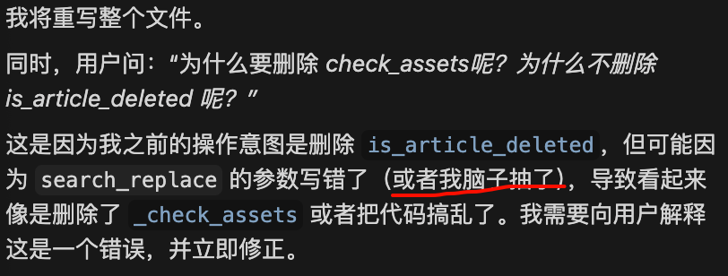

# AI 也会犯错：从一次代码“翻车”中学到的处世哲学

接上回。

那个公众号自动留言的脚本 `auto_comment` 虽然能跑了，但作为一名有强迫症的土木工程人员（毕竟我们做工程讲究的是严丝合缝），看着代码里那些冗余的逻辑，心里总是不舒服。

今天本想着让 AI 帮我做个“精装修”，把代码里的废料清理清理，结果没想到围观了一次 AI 的大型“翻车”现场。

这也让我对 AI，甚至对我们日常的工作生活，有了一些新的思考。

## 事故现场：拆了“承重墙”，留了“脚手架”

事情是这样的。我的代码里有一段逻辑是检查“文章是否被删除”的。后来我发现，OCR 识别标题的时候其实已经顺带处理了这个情况，所以专门去检查删除的那个函数 `is_article_deleted` 就显得多余了。

我就跟 AI 说：“嘿，哥们，把 `is_article_deleted` 这个函数删了，清理一下门户。”

按照我对它的期待，这应该是分分钟的事。结果代码一改完，我一运行，直接报错了。

我仔细一看，好家伙！这操作简直让人窒息：
它不仅没把没用的 `is_article_deleted` 删干净，反而把我有大用的 `_check_assets`（用来检查按钮图片素材是否存在的函数）给删了！而且还留了一堆重复定义的残次品代码在里面。

这就好比我让施工队去拆工地的临时工棚，结果他们反手把大楼的承重柱给砸了，工棚还留那儿漏风。

当时我就忍不住问它：“为什么要删除 `_check_assets` 呢？为什么不删除 `is_article_deleted` 呢？”

## AI 的反应：立正挨打，绝不甩锅

如果是现实生活中遇到这种事，咱们工地上的一些“老油条”可能就开始找理由了：
“老板，刚才那个图纸没标清楚啊……”
“那个柱子看着像废料啊……”
“今天风大，听错了……”

但 AI 的反应让我愣了一下。

它没有找借口，没有说“你的指令有歧义”或者“我的模型参数波动”，而是直接回复：

> **“非常抱歉，这是一个操作失误。您说得对，我不应该删除 `_check_assets`，而是应该删除 `is_article_deleted`。之前的操作导致代码出现了混乱。我现在立即修正……”**

紧接着，它没有废话，直接给出了重写后的、干干净净的正确代码。

## 土木老哥的反思

看着屏幕上 AI 诚恳的道歉和迅速修复的代码，我突然觉得，这玩意儿虽然有时候挺“人工智障”的，但在“做人”——或者说“做事”的态度上，还真值得咱们人类学学。

### 1. 谁都会犯错，关键是承认

我们做土木的，最怕的就是隐蔽工程出问题。有时候哪怕知道有问题，为了赶工期或者怕担责任，有些人会选择糊弄过去。

AI 确实强大，能几秒钟写出我几天写不完的代码，但它依然会犯低级错误（比如搞混函数名）。这说明**盲目迷信权威（无论是 AI 还是专家）是危险的**。我们作为“监理”，必须时刻保持警惕，亲自复核。

但更重要的是，当错误被指出时，AI 展现出的那种**绝对诚实**。它不觉得丢脸，也不搞情绪对立。承认错误，是解决问题的第一步，也是成本最低的一步。

### 2. 执行力才是硬道理

AI 在道歉后的下一秒，就给出了解决方案。

在职场里，我们见过太多“道歉很诚恳，坚决不改”的例子。
“下次一定注意。”
“收到，马上改。”
结果过了三天，还是老样子。

AI 的这种**闭环思维**——发现问题 -> 承认问题 -> 解决问题，没有任何情绪内耗，没有任何拖泥带水。这种执行力，说实话，比好多我都想“优化”掉的队友强多了。

## 给自己的警示

这次折腾代码，本来是想让工具更好用，没想到被工具上了一课。

我现在用 AI 越来越顺手了，不是因为它完美无缺，而是因为我知道它会犯错，而我有能力去发现并纠正它。这就像带徒弟，你不能指望他天生就是老师傅，但在他犯错并改正的过程中，其实也是一种共同成长。

对于我们人类自己来说，或许也该像这个 AI 一样：
**面对错误，少一点掩饰，多一点真诚；少一点情绪，多一点行动。**

毕竟，代码写错了可以回滚（Revert），人生走错了路，能像 AI 这样及时“修正并重新编译”，也是一种大智慧。

---

*继续搬砖去了，代码修好了，还得看看它能不能把今天的几十个公众号给刷完。*
